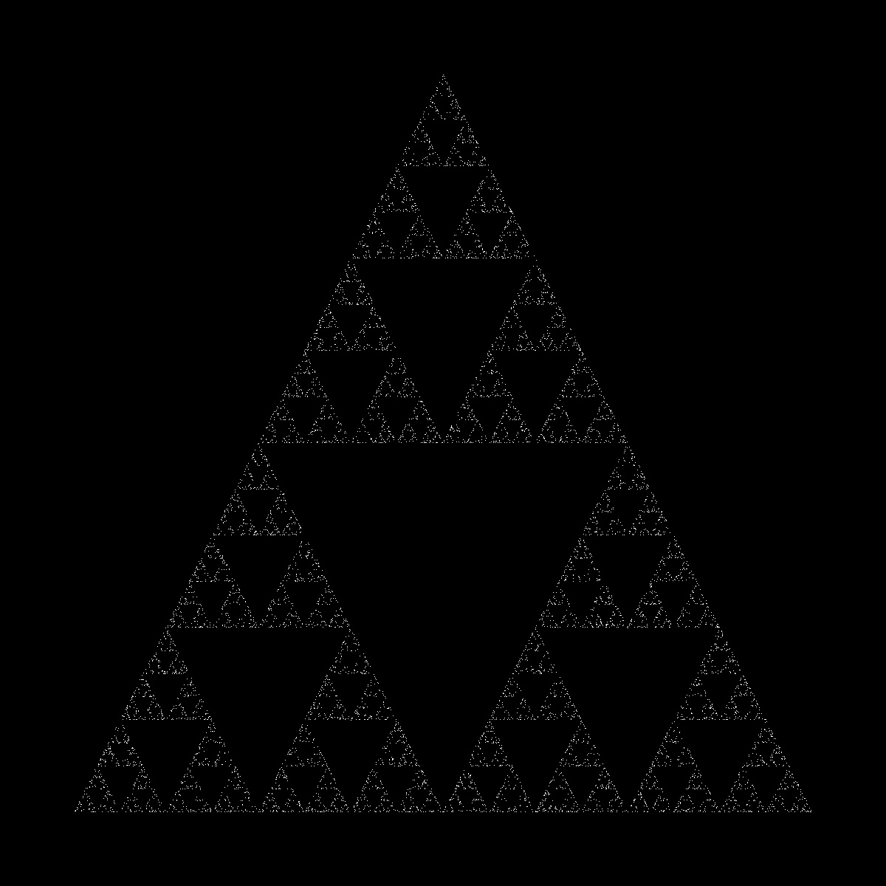

# sierpinski_triangle

I saw an instagram reel where you can create cool fractal patterns by generating random points, so decided to give it a shot in python!

### How this works
- You start with the three vertices of a triangle
- You pick a random point and a random vertex
- Find the midpoint between the random point and the vertex and draw the midpoint
- Now pick another random vertex and draw the midpoint between the vertex and the last point
- Repeat the last step many times